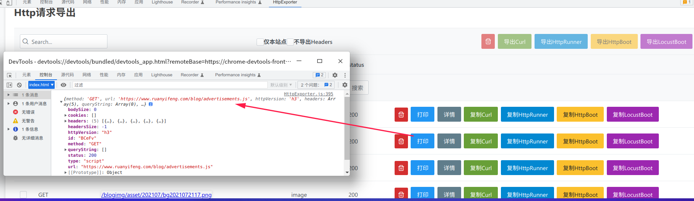

[GitHub](https://github.com/shigebeyond/chrome-ext) | [Gitee](https://gitee.com/shigebeyond/chrome-ext) 

chrome扩展包，包含一系列提升个人学习、工作效率的工具

# 缘由
看知乎上有些回答挺好，想复制下来，结果被限制复制(禁止转载)。

但难不住作为程序员的我，通过在devtool中写js，也能打印出回答对应的html标签的内容。

但是每次都写js很繁琐，因此想做成chrome扩展，直接双击就能将回答文本复制到内存(剪切板)。

后续逐渐扩展功能，陆续实现了翻译、远程打开、备份标签页、http请求复制与导出(curl/HttpRunner/HttpBoot)等功能

用到的技术包含: es6, react18, [primereact-UI库](https://www.primefaces.org/primereact/), [webredis-消息服务器](https://gitee.com/shigebeyond/webredis)

# 安装
1. 下载源码
```
git clone https://github.com/shigebeyond/chrome-ext.git
```

2. 安装依赖
```
npm i
``` 

3. 编译
```
npm run build
```

4. 将`build/`目录拖到chrome扩展程序页面

# 功能
## 1. 选项配置


## 2. 双击-复制知乎回答


在打开知乎网页时自动注入复制脚本，后续通过双击某个回答，来将回答文本复制到内存(剪切板);

仅对知乎网站有效。

## 3. 右键菜单-网页剪报


收集当前网页的title+url+选中文本，并提交到配置的提交地址中(如 http://localhost/note.php)，以便记录到本地文件中。

其中 note.php 的实现可参考
```
<?php
$r = file_put_contents('/home/shi/note.txt', $_POST['note']."\n\n", FILE_APPEND);
echo $r ? 'true' : 'false';
```

## 4. 右键菜单-有道词典
选中单次后再右键菜单


查找单词结果


## 5. 右键菜单-有道翻译
选中单次后再右键菜单


翻译结果


## 6. 右键菜单-连接消息服务器


通过 [socket.io](https://github.com/socketio/socket.io-client) 来连接到配置的消息服务器(如 http://127.0.0.1:16379)

在连接前，请确保启动了消息服务器，详细参考 [webredis](https://gitee.com/shigebeyond/webredis)

目前消息只支持：远程打开

## 7. 右键菜单-远程打开


针对多个浏览器(多台电脑)连接到同一个消息服务器场景，该菜单会在其他浏览器中打开当前浏览器的当前页面，适用于多台电脑之间的浏览器协作。

## 8. 右键菜单-备份当前标签页
或快捷键 alt+b


关闭当前标签页，并将其标题与url存到本地

## 9. 右键菜单-备份所有标签页


关闭所有标签页，并将其标题与url存到本地

## 10. 右键菜单-管理备份的标签页


打开备份标签页的管理页面，你可以看到所有备份的数据，并可以进行以下操作: 修改、删除、打开、导出


## 11. DevTools panel-HttpExporter


监控当前网页中访问过的 http 请求，支持以下操作：
- 对单个请求: 支持删除、打印、详情，也支持生成脚本并复制到剪切板，复制类型包含curl命令、HttpRunner的yaml脚本、HttpBoot的yaml脚本
- 对选中的多个请求: 支持删除、搜索，也支持导出文件，导出类型包含curl命令、HttpRunner的yaml脚本、HttpBoot的yaml脚本

1. 打印

 
2. 详情


3. 复制curl命令, 结果如下:
```
# 无headers的curl命令
curl 'https://www.ruanyifeng.com/blog/archives.html'   

# 有headers的curl命令
curl 'https://www.ruanyifeng.com/blog/archives.html' \
  -H 'accept:text/html,application/xhtml+xml,application/xml;q=0.9,image/avif,image/webp,image/apng,*/*;q=0.8,application/signed-exchange;v=b3;q=0.9' \
  -H 'accept-encoding:gzip, deflate, br' \
  -H 'accept-language:en,zh;q=0.9,zh-CN;q=0.8' \
  -H 'cache-control:max-age=0' \
  -H 'cookie:_ga=GA1.2.520720828.1664344154; Hm_lvt_f89e0235da0841927341497d774e7b15=1664344154; _gid=GA1.2.1896287579.1666578027; Hm_lpvt_f89e0235da0841927341497d774e7b15=1666578027' \
  -H 'if-modified-since:Mon, 24 Oct 2022 02:09:49 GMT' \
  -H 'referer:https://www.ruanyifeng.com/blog/archives.html' \
  -H 'sec-ch-ua:"Chromium";v="104", " Not A;Brand";v="99", "Google Chrome";v="104"' \
  -H 'sec-ch-ua-mobile:?0' \
  -H 'sec-ch-ua-platform:"Linux"' \
  -H 'sec-fetch-dest:document' \
  -H 'sec-fetch-mode:navigate' \
  -H 'sec-fetch-site:same-origin' \
  -H 'sec-fetch-user:?1' \
  -H 'upgrade-insecure-requests:1' \
  -H 'user-agent:Mozilla/5.0 (X11; Linux x86_64) AppleWebKit/537.36 (KHTML, like Gecko) Chrome/104.0.0.0 Safari/537.36'   
```

4. 复制HttpRunner的yaml脚本, 结果如下:
```
# 无headers的HttpRunner的yaml脚本
- test:
    name: /blog/archives.html
    request:
        url: https://www.ruanyifeng.com/blog/archives.html
        method: GET
    validate:
        - eq: ['status_code', 304]


# 有headers的HttpRunner的yaml脚本
- test:
	name: /blog/archives.html
	request:
		url: https://www.ruanyifeng.com/blog/archives.html
		method: GET
		headers: 
			accept: text/html,application/xhtml+xml,application/xml;q=0.9,image/avif,image/webp,image/apng,*/*;q=0.8,application/signed-exchange;v=b3;q=0.9
			accept-encoding: gzip, deflate, br
			accept-language: en,zh;q=0.9,zh-CN;q=0.8
			cache-control: max-age=0
			cookie: _ga=GA1.2.520720828.1664344154; Hm_lvt_f89e0235da0841927341497d774e7b15=1664344154; _gid=GA1.2.1896287579.1666578027; Hm_lpvt_f89e0235da0841927341497d774e7b15=1666580394
			if-modified-since: Mon, 24 Oct 2022 02:09:49 GMT
			referer: https://www.ruanyifeng.com/blog/archives.html
			sec-ch-ua: "Chromium";v="104", " Not A;Brand";v="99", "Google Chrome";v="104"
			sec-ch-ua-mobile: ?0
			sec-ch-ua-platform: "Linux"
			sec-fetch-dest: document
			sec-fetch-mode: navigate
			sec-fetch-site: same-origin
			sec-fetch-user: ?1
			upgrade-insecure-requests: 1
			user-agent: Mozilla/5.0 (X11; Linux x86_64) AppleWebKit/537.36 (KHTML, like Gecko) Chrome/104.0.0.0 Safari/537.36
	validate:
		- eq: ['status_code', 304]
```

5. 复制HttpBoot的yaml脚本, 结果如下:
```
# 无headers的HttpBoot的yaml脚本
- get:
    url: https://www.ruanyifeng.com/blog/archives.html
    validate_by_jsonpath:
        '$.code':
            '=': 304

# 有headers的HttpBoot的yaml脚本
- get:
	url: https://www.ruanyifeng.com/blog/archives.html
	headers: 
		accept: text/html,application/xhtml+xml,application/xml;q=0.9,image/avif,image/webp,image/apng,*/*;q=0.8,application/signed-exchange;v=b3;q=0.9
		accept-encoding: gzip, deflate, br
		accept-language: en,zh;q=0.9,zh-CN;q=0.8
		cache-control: max-age=0
		cookie: _ga=GA1.2.520720828.1664344154; Hm_lvt_f89e0235da0841927341497d774e7b15=1664344154; _gid=GA1.2.1896287579.1666578027; Hm_lpvt_f89e0235da0841927341497d774e7b15=1666580394
		if-modified-since: Mon, 24 Oct 2022 02:09:49 GMT
		referer: https://www.ruanyifeng.com/blog/archives.html
		sec-ch-ua: "Chromium";v="104", " Not A;Brand";v="99", "Google Chrome";v="104"
		sec-ch-ua-mobile: ?0
		sec-ch-ua-platform: "Linux"
		sec-fetch-dest: document
		sec-fetch-mode: navigate
		sec-fetch-site: same-origin
		sec-fetch-user: ?1
		upgrade-insecure-requests: 1
		user-agent: Mozilla/5.0 (X11; Linux x86_64) AppleWebKit/537.36 (KHTML, like Gecko) Chrome/104.0.0.0 Safari/537.36
	validate_by_jsonpath:
		'$.code':
			'=': 304
```