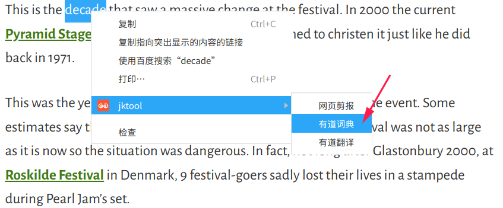

[GitHub](https://github.com/shigebeyond/chrome-ext) | [Gitee](https://gitee.com/shigebeyond/chrome-ext) 

# 缘由
看知乎上有些回答挺好，想复制下来，结果被限制复制(禁止转载)。

但难不住作为程序员的我，通过在devtool中写js，也能打印出回答对应的html标签的内容。

但是每次都写js很繁琐，因此想做成chrome扩展，直接将回答文本复制到内存(剪切板)。

# 安装
1. 下载源码
```
git clone https://github.com/shigebeyond/chrome-ext.git
```

2. 将源码目录拖到chrome扩展程序页面

# 功能
1. 选项配置


2. 双击-复制知乎回答


在打开知乎网页时自动注入复制脚本，后续通过双击某个回答，来将回答文本复制到内存(剪切板);

仅对知乎网站有效。

3. 右键菜单-网页剪报


收集当前网页的title+url+选中文本，并提交到配置的提交地址中(如 http://localhost/note.php)，以便记录到本地文件中。

其中 note.php 的实现可参考
```
<?php
$r = file_put_contents('/home/shi/note.txt', $_POST['note']."\n\n", FILE_APPEND);
echo $r ? 'true' : 'false';
```

4. 右键菜单-有道词典
选中单次后再右键菜单


查找单词结果


5. 右键菜单-有道翻译
选中单次后再右键菜单


翻译结果


6. 右键菜单-连接消息服务器


通过 [socket.io](https://github.com/socketio/socket.io-client) 来连接到配置的消息服务器(如 http://127.0.0.1:16379)

在连接前，请确保启动了消息服务器，详细参考 [webredis](https://gitee.com/l0km/webredis)

目前消息只支持：远程打开

7. 右键菜单-远程打开


针对多个浏览器(多台电脑)连接到同一个消息服务器场景，该菜单会在其他浏览器中打开当前浏览器的当前页面，适用于多台电脑之间的浏览器协作。

8. 右键菜单-备份当前标签页


关闭当前标签页，并将其标题与url存到本地

9. 右键菜单-备份所有标签页


关闭所有标签页，并将其标题与url存到本地

10. 右键菜单-管理备份的标签页


打开备份标签页的管理页面，你可以看到所有备份的数据，并可以进行以下操作: 修改、删除、打开、导出


11. DevTools panel-HttpExporter


监控当前网页中访问过的 http 请求，支持以下操作：
```
1 对单个请求，支持生成脚本并复制到剪切板，复制类型包含curl命令、HttpRunner的yaml脚本、HttpBoot的yaml脚本
2 对选中的多个请求，支持导出文件，导出类型包含curl命令、HttpRunner的yaml脚本、HttpBoot的yaml脚本
```